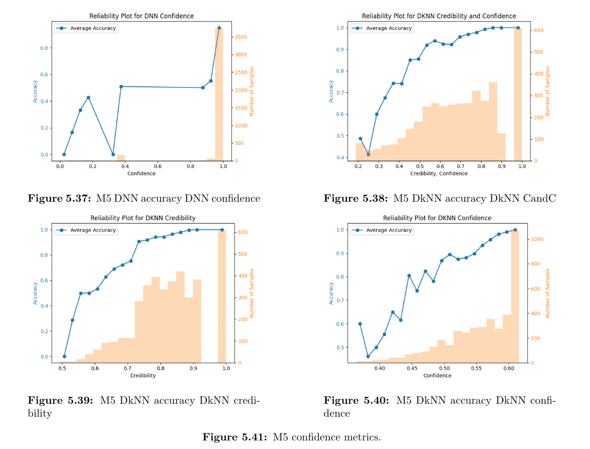
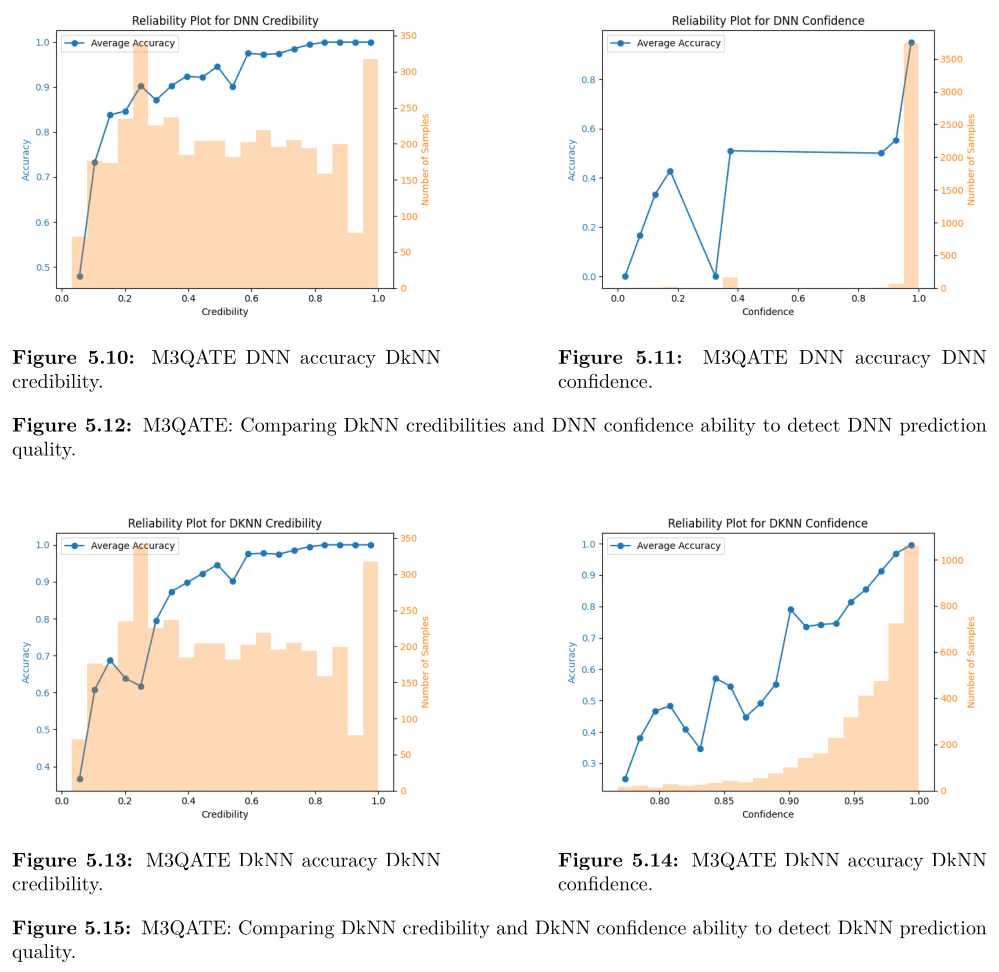

# Deep k-Nearest Neighbors (DkNN) on Resource-Constrained Hardware

## Overview

This project extends my thesis on deploying **Deep k-Nearest Neighbors (DkNN)** on resource-constrained hardware, such as edge devices, with a focus on quantized model implementations. Future algorithmic improvements, as outlined under Future Research, will also be explored here.

### Outline
- Explanation of DkNN
- Key Findings of My Thesis
- Suggestions for Future Research
- Summary of a Key Experiment

### What is DkNN?

DkNN is an innovative approach that combines **Deep Neural Networks (DNNs)** with **k-Nearest Neighbors (kNN)** to enhance DNNs by:
1. **Interpretability**: Providing insights into predictions by analyzing layer-wise nearest neighbors.
2. **Confidence**: Quantifying the likelihood of correct predictions.
3. **Robustness**: Strengthening resilience against adversarial attacks.

DkNN enriches traditional neural networks by applying kNN at each hidden layer, leveraging representations from training data to calibrate confidence estimates. This hybrid approach addresses critical challenges in DNN predictions. Key metrics include:
- **Confidence**: The likelihood of accurate predictions based on neighbor consensus.
- **Credibility**: The relevance of training data to a given input.

---

## Discussion

### Key Findings
1. **Resource Constraints**: The kNN component presented significant memory and processing demands, particularly for larger datasets and models. Despite this, DkNN performed well in constrained environments when layer representations were compact.
   
2. **Quantization**: Deploying quantized DkNN models with TensorFlow Lite (TFLite) resulted in superior runtime performance compared to non-quantized versions, with negligible losses in accuracy and interpretability.

3. **Confidence and Credibility**: Credibility consistently outperformed confidence as a reliability metric in both standard and adversarial contexts. Combining these metrics slightly improved prediction certainty.

4. **Adversarial Robustness**: While DkNN models were more vulnerable to adversarial attacks than standard DNNs, credibility metrics significantly improved the detection of adversarial inputs.

5. **Interpretability**: By mapping predictions to training data neighbors, DkNN improved transparency. However, the subjectivity of interpretability limited its effectiveness in explaining incorrect classifications.

### Limitations
- **Scalability**: Deploying DkNN on larger datasets (e.g., TinyImageNet) imposed computational overhead, making it less practical for resource-constrained devices.
- **Dataset Generalizability**: Experiments were confined to MNIST and FashionMNIST, necessitating validation on more complex datasets.
- **Hardware Constraints**: Compatibility issues with the Google Coral’s software reduced deployment efficiency.

---

## Future Research

### Ongoing Work
I am currently collaborating with my research group to publish a paper and conduct further experiments.

### Proposed Directions
1. **Enhanced Confidence Metrics for Ensemble Models**:
   - Combine multiple DNNs, each specializing in different data types, using DkNN-derived confidence scores.

2. **Improved DkNN Framework**:
   - Introduce **layer-wise weighted kNN**, optimizing `k` per layer.
   - Integrate advanced metrics:
     - **Confidence**: As defined in the original DkNN paper.
     - **Ambiguity**: Proximity to decision boundaries based on label distribution.
     - **Relevance**: Distance to nearest neighbors as a representation quality measure.
     - A **dynamically optimized linear combination** of these metrics using a calibration set.

3. **Optimized Quantization**:
   - Investigate methods to preserve robustness and performance in quantized DkNN models deployed on edge devices.

---

## Experiment: Applying DkNN to Select Layers
### Objective
To reduce computational demands without compromising accuracy by selectively applying kNN computations to specific layers.

### Methodology
- Developed a new model, designation: **M5**, which excluded kNN layers from three intermediate representations, contrasting it with the original model designated **M3**, which used all 8 layers.
- Evaluated performance using metrics such as setup time, inference duration, accuracy, confidence, and credibility under a quantized deployment.

### Results
| **Metric**                               | **Selective Model (M5)** | **Original Model (M3)** |
| ---------------------------------------- | ------------------------ | ----------------------- |
| Model Initialization Duration (seconds)  | 3.5573                   | 4.3321                  |
| Total Inference Time (seconds)           | 356                      | 1439                    |
| Mean DNN Inference Time/Sample (seconds) | 0.0334                   | 0.0337                  |
| Mean kNN Query Time/Sample (seconds)     | 0.0445                   | 0.1799                  |
| Time Spent Waiting for kNN (seconds)     | 44                       | 584                     |
| DNN Accuracy                             | 0.9220                   | 0.9220                  |
| DNN Precision                            | 0.9230                   | 0.9230                  |
| DNN Recall                               | 0.9222                   | 0.9222                  |
| DkNN Accuracy                            | 0.9223                   | 0.8645                  |
| DkNN Precision                           | 0.9223                   | 0.8872                  |
| DkNN Recall                              | 0.9225                   | 0.8660                  |

1. **Efficiency**:
   - M5 was **40% smaller** than M3, with inference times reduced by a factor of four.
   - This was due to the significantly shorter kNN query time per sample for M5 (0.0445s vs. 0.1799s for M3).

2. **Accuracy**:
   - DkNN accuracy improved in M5 (92.23%) compared to M3 (86.45%).
   - The selective model achieved slightly higher accuracy than the base DNN, whereas the original model performed significantly worse.

**Reliability Graphs**: The x-axis bins samples based on metrics like confidence, credibility, accuracy, or combined C&C score. The y-axes show accuracy per bin (line) and the number of samples per bin (bars). A monotonic increase in accuracy with rising confidence indicates good calibration, while concentration near 0% and 100% signifies sharpness.

3. **Confidence Metrics**:
   - DkNN confidence metrics are significantly more reliable than DNN softmax confidence, offering both strong calibration and assigning the highest confidence values to a large number of samples with 100% accuracy.
   - My combined score (CandC) does not outperform DkNN confidence. However, given its straightforward design, there is likely room for improvement, though credibility may require a more fundamental redesign.
   - When compared to M3’s confidence metrics, M5’s performed roughly on par (see comparison in the previous and next graphs).

### Conclusion
Selective application of kNN layers in M5 retained or enhanced accuracy and interpretability while drastically reducing computational overhead. 

---
